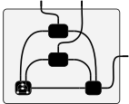

#  Convolutions Through the Lens of Tensor Networks

This package offers white-box implementations of convolutions and related
operations in PyTorch via `einsum`. You have full control and can easily make
modifications to try out new ideas.

## Installation
Install from PyPI via `pip`

```bash
pip install einconv
```

### Disclaimer

This package has the same name as
[this](https://github.com/pfnet-research/einconv) Github repository which
represented the starting point for our work. Our package goes beyond it by
providing more routines and functionality for optimizing computations.

## Quick-start

## Features & Usage

In general, `einconv`'s goals are:
- Full hyper-parameter support (stride, padding, dilation, groups, etc.)
- Support for any dimension (e.g. 5d-convolution)
- Optimizations via symbolic simplification

### High-level features

`einconv` provides `einsum`-based implementations of the following PyTorch
modules and functionals:

| `torch`                      | `einconv` (arbitrary `N`) |
|------------------------------|---------------------------|
| `nn.Conv{1,2,3}d`            | `ConvNd`                  |
| `nn.Unfold`                  | `UnfoldNd`                |
|------------------------------|---------------------------|
| `nn.functional.conv{1,2,3}d` | `convNd`                  |
| `nn.functional.unfold`       | `unfoldNd`                |

### Low-level features

`einconv` can generate `einsum` expressions (equation, operands, and output
shape) for the following operations:

- Forward pass of `N`-dimensional convolution
- Backward pass (input and weight VJPs) of `N`-dimensional convolution
- Input unfolding (`im2col/unfold`) for inputs of `N`-dimensional convolution

These can then be evaluated with `einsum`:
```python
equation, operands, final_shape = einsum_expression(...)
result = einsum(equation, *operands).reshape(final_shape)
```

### Optimizations

Some operations (e.g. dense convolutions) can be optimized via symbolic simplifications:
```python
equation_opt, operands_opt, final_shape = simplify(equation, operands)
# alternatively:
# equation_opt, operands_opt, final_shape = einsum_expression(..., simplify=True)
result_opt = einsum(equation_opt, *operands_opt).reshape(final_shape)

allclose(result, result_opt) # True
```

## Citation

If you find the `einconv` package useful for your research, consider mentioning
the accompanying article

```bibtex

@article{dangel2023convolutions,
  title =        {Convolutions Through the Lens of Tensor Networks},
  author =       {Dangel, Felix},
  year =         2023,
}

```
## Limitations

- TODO
