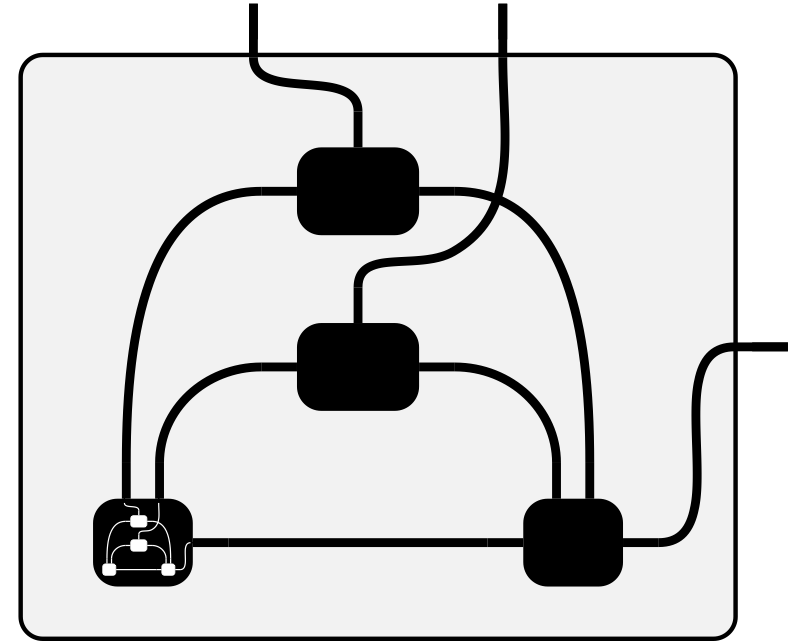

#  Convolutions Through the Lens of Tensor Networks

This package offers `einsum`-based implementations of convolutions and related
operations in PyTorch.

Its name is inspired by [this](https://github.com/pfnet-research/einconv) Github
repository which represented the starting point for our work.

## Installation
Install from PyPI via `pip`

```sh
pip install einconv
```

## Examples

- [Basic
  example](https://einconv.readthedocs.io/en/latest/tutorials/basic_conv2d/)

- For more tutorials, check out the
  [docs](https://einconv.readthedocs.io/en/latest/)

## Features & Usage

In general, `einconv`'s goals are:

- Full hyper-parameter support (stride, padding, dilation, groups, etc.)
- Support for any dimension (e.g. 5d-convolution)
- Optimizations via symbolic simplification

### Modules

`einconv` provides `einsum`-based implementations of the following PyTorch modules:

| `torch` module    | `einconv` module   |
|-------------------|--------------------|
| `nn.Conv{1,2,3}d` | `modules.ConvNd`   |
| `nn.Unfold`       | `modules.UnfoldNd` |

They work in exactly the same way as their PyTorch equivalents.

### Functionals

`einconv` provides `einsum`-based implementations of the following PyTorch functionals:

| `torch` functional           | `einconv` functional   |
|------------------------------|------------------------|
| `nn.functional.conv{1,2,3}d` | `functionals.convNd`   |
| `nn.functional.unfold`       | `functionals.unfoldNd` |

They work in exactly the same way as their PyTorch equivalents.

### Einsum Expressions
`einconv` can generate `einsum` expressions (equation, operands, and output
shape) for the following operations:

- Forward pass of `N`-dimensional convolution
- Backward pass (input and weight VJPs) of `N`-dimensional convolution
- Input unfolding (`im2col/unfold`) for inputs of `N`-dimensional convolution
- Input-based Kronecker factors of Fisher approximations for convolutions (KFC
  and KFAC-reduce)

These can then be evaluated with `einsum`. For instance, the `einsum` expression
for the forward pass of an `N`-dimensional convolution is

```py
from torch import einsum
from einconv.expressions import convNd_forward

equation, operands, shape = convNd_forward.einsum_expression(...)
result = einsum(equation, *operands).reshape(shape)
```

All expressions follow this pattern.

### Symbolic Simplification

Some operations (e.g. dense convolutions) can be optimized via symbolic
simplifications. This is turned on by default as it generally improves
performance. You can also generate a non-optimized expression and simplify it:

```py
from einconv import simplify

equation, operands, shape = convNd_forward.einsum_expression(..., simplify=False)
equation, operands = simplify(equation, operands)
result = einsum(equation, *operands).reshape(shape)
```

Sometimes it might be better to inspect the non-simplified expression to see how
indices relate to operands.

## Citation

If you find the `einconv` package useful for your research, consider mentioning
the accompanying article

```bib

@article{dangel2023convolutions,
  title =        {Convolutions Through the Lens of Tensor Networks},
  author =       {Dangel, Felix},
  year =         2023,
}

```
## Limitations

- Currently, none of the underlying operations (computation of index pattern
  tensors, generation of einsum equations and shapes, simplification) is cached.
  This consumes additional time, although it should usually take much less time
  than evaluating an expression via `einsum`.

- At the moment, the code to perform expression simplifications is coupled with
  PyTorch. I am planning to address this in the future by switching the
  implementation to a symbolic approach which will also allow efficient caching.
